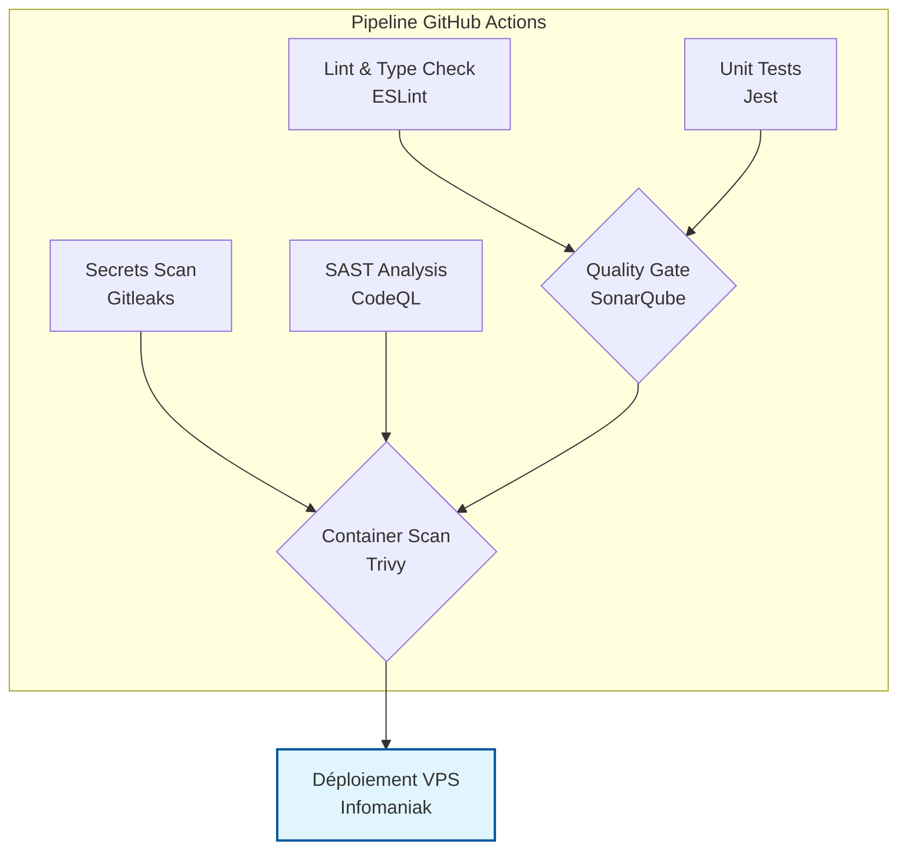
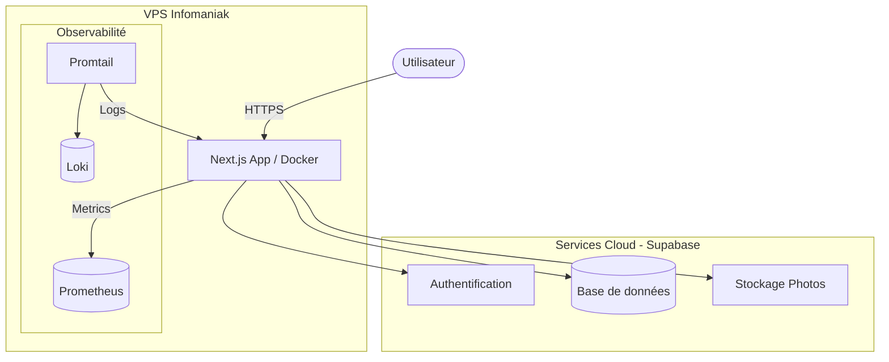

# Architecture & Infrastructure
 
Ce document détaille l'organisation technique du projet NOMOS, son infrastructure et son pipeline de déploiement continu.
 
## 1. Pipeline CI/CD
 
Le pipeline est déclenché à chaque push sur la branche `main` via GitHub Actions. Il assure la sécurité et la qualité du code avant toute mise en production.
 

 
### Étapes détaillées :
1.  **Gitleaks** : Scan de tout l'historique pour détecter d'éventuels secrets (clés API, mots de passe) commités par erreur.
2.  **CodeQL** : Analyse statique approfondie pour détecter les vulnérabilités logiques (injections, XSS, etc.).
3.  **Tests Unitaires (Jest)** : Exécution de la suite de tests pour garantir le bon fonctionnement des services et composants. La couverture est ensuite envoyée à SonarQube.
4.  **SonarQube** : Analyse de la qualité du code, détection de la dette technique et vérification que la Quality Gate est respectée.
5.  **Trivy** : Scan de l'image Docker finale pour identifier des vulnérabilités (CVE) dans les packages système ou les dépendances.
6.  **Déploiement** : Si toutes les étapes précédentes sont au vert, on se connecte au vps pour mettre à jour et deployer les modifications
 
## 2. Infrastructure
 
L'infrastructure repose sur un modèle hybride : une partie auto-hébergée sur un VPS (pour l'application et le monitoring) et une partie SaaS via Supabase (pour les données et l'authentification)
 
### Schéma de l'infrastructure
 

